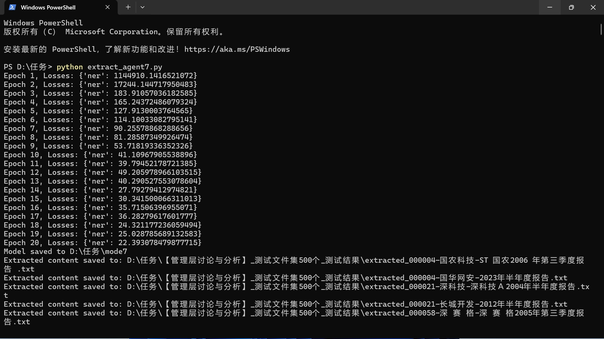

# FinReport-NLP

> Large-scale NLP-based information extraction from financial reports.

[](https://www.python.org/)
[](LICENSE)
[](https://spacy.io/)
[](models/mode7/)

FinReport-NLP is an NLP-based document information extraction pipeline designed
to automatically identify and extract target sections from large-scale financial
reports.

The project was originally developed to process about **22,800** financial
report documents and extract specific semantic sections such as:

- Management's Discussion and Analysis (管理层讨论与分析 / MD&A)
- Risk Factors
- Business Overview
- Other target financial-report sections

It covers the complete workflow from document preprocessing and dataset
construction to **spaCy NER** model training, hybrid inference, validation, and
large-scale batch extraction.

Originally developed in 2024–2025. Reorganized and open-sourced in 2026.

### Real-world validation

The pipeline was built for a **paid PhD research data-processing engagement**.
After iterative training (**mode1 → mode7**), the final **mode7** model
successfully completed section extraction on the full ~22,800-file corpus. The
researcher was highly satisfied with the delivered results — this project was
validated in a real academic workflow, not only as a demo.

---

## Features

- Batch processing of large collections of financial documents
- PDF / text preprocessing (`pdfplumber`)
- Training dataset construction & validation
- spaCy Chinese blank model + NER (`TARGET_SECTION`)
- Hybrid extraction: **rules first**, NER fallback
- **Pretrained final model `mode7` included**
- Batch inference with extraction logs
- Structured text / JSON output

---

## Pretrained Model: mode7

The final production model is included at [`models/mode7/`](models/mode7/)
(~3.7 MB). It is the last version after multiple training rounds (mode1–mode7).

Training terminal log (20 epochs; loss converges; then batch extraction):



```bash
python scripts/extract_sections.py \
  --input path/to/txt_reports \
  --output outputs/ \
  --model models/mode7
```

Want to publish the same model on Hugging Face / Zenodo / ModelScope?
See [`docs/publishing.md`](docs/publishing.md).

---

## Project Pipeline

```text
Financial Reports
        │
        ▼
PDF / Text Preprocessing
        │
        ▼
Text Cleaning & Keyword Filtering
        │
        ▼
Training Dataset Construction
        │
        ▼
spaCy NER Model Training (mode1 → mode7)
        │
        ▼
Hybrid Inference (Rules → NER)
        │
        ▼
Target Section Extraction (~22,800 files)
        │
        ▼
Validation & Post-processing
        │
        ▼
Structured Output
```

### Example

**Input (excerpt):**

```text
第三节 管理层讨论与分析
报告期内，公司实现营业收入110亿元……
第四节 公司治理
```

**Output:**

```json
{
  "section": "管理层讨论与分析",
  "text": "报告期内，公司实现营业收入110亿元……"
}
```

---

## Tech Stack (verified from original code)

| Component | Choice |
|-----------|--------|
| Framework | [spaCy](https://spacy.io/) `>=3.8,<3.9` |
| Model | `spacy.blank("zh")` + `ner` pipe |
| Label | `TARGET_SECTION` |
| Final artifact | `models/mode7` |
| Training | 20 epochs, minibatch=4, dropout=0.2 |
| Hybrid | regex start/end markers → NER fallback |
| PDF | `pdfplumber` |

---

## Installation

```bash
git clone https://github.com/jasonlhw-rgb/FinReport-NLP.git
cd FinReport-NLP
python -m venv .venv

# Windows
.venv\Scripts\activate

# Linux / macOS
# source .venv/bin/activate

pip install -r requirements.txt
python -m spacy download zh_core_web_sm
```

> Note: training uses a **blank** Chinese model (`spacy.blank("zh")`), so the
> pretrained download is optional for the core pipeline. Install it if you want
> additional Chinese NLP utilities.

---

## Quick Start

### A. Use the published mode7 model

```bash
python scripts/extract_sections.py \
  --input data/sample/reports \
  --output outputs/ \
  --model models/mode7 \
  --log outputs/extraction_log.csv
```

### B. Reproduce a small training demo

```bash
python scripts/validate_dataset.py

python scripts/train.py \
  --data data/sample/sample_training_data.json \
  --output models/target_section_ner \
  --epochs 5
```

---

## Datasets

| Resource | Description | Link |
|----------|-------------|------|
| In-repo sample | Synthetic demo JSON + reports | [`data/sample/`](data/sample/) |
| Full TXT corpus | ~**22,800** financial-report text files | https://caiwushi.net/ |
| Training / test / smaller sets | Annotated training data, test sets, related files | [Google Drive](https://drive.google.com/drive/folders/19Qco5VdHnL1niEejzCE-LQr3aiEFF6E-?usp=drive_link) |

Details: [`data/README.md`](data/README.md).

Please use external corpora in accordance with applicable copyright and
research-use norms.

---

## Project Structure

```text
FinReport-NLP/
├── src/finreport_nlp/     # Core library
├── scripts/               # CLI entry points
├── configs/
├── data/sample/           # Synthetic demo data
├── models/mode7/          # Final pretrained spaCy NER model
├── examples/
├── docs/                  # Architecture, history, publishing guide
├── tests/
├── README.md
├── LICENSE
└── requirements.txt
```

---

## Development History

The project evolved through multiple experimental iterations, including
**repeated model training from early versions up to mode7**:

1. Financial document collection and PDF→text conversion
2. Keyword filtering (e.g. 管理层讨论与分析)
3. Training sample construction & JSON normalization
4. Iterative spaCy NER training (**mode1 → mode6**)
5. Final model **mode7** + rule robustness (`extract_agent7`)
6. Large-scale batch inference on ~22,800 files
7. Delivery to PhD research client (strong positive feedback)
8. Open-source reorganization (2026)

See [`docs/development-history.md`](docs/development-history.md) for details.

---

## Use Cases

- Financial / academic research
- Financial text mining
- Corporate analysis
- Document intelligence / Document AI
- Alternative financial data construction

---

## Limitations

Extraction quality depends on report format, OCR/PDF text quality, document
structure, language, training data, and section definitions.

This repository is a **research and engineering reference implementation**, not
a production-ready financial data service.

---

## Roadmap

- [x] Publish pretrained **mode7** in-repo
- [ ] Mirror mode7 on Hugging Face Model Hub
- [ ] Evaluation benchmarks (Precision / Recall / F1)
- [ ] Stronger preprocessing for heterogeneous report layouts
- [ ] Multilingual / multi-section support
- [ ] Docker support
- [ ] GitHub Actions CI
- [ ] Optional demo (Hugging Face Spaces)

---

## Contact

Questions, collaboration, or academic reuse of the datasets:

- Email: **jason.lhw2025@gmail.com**
- GitHub Issues: https://github.com/jasonlhw-rgb/FinReport-NLP/issues

---

## Contributing

Contributions, bug reports, and suggestions are welcome.
Please see [CONTRIBUTING.md](CONTRIBUTING.md).

---

## Citation

If you use this project in research, please cite it using [`CITATION.cff`](CITATION.cff).

---

## License

This project is licensed under the MIT License. See [LICENSE](LICENSE).
