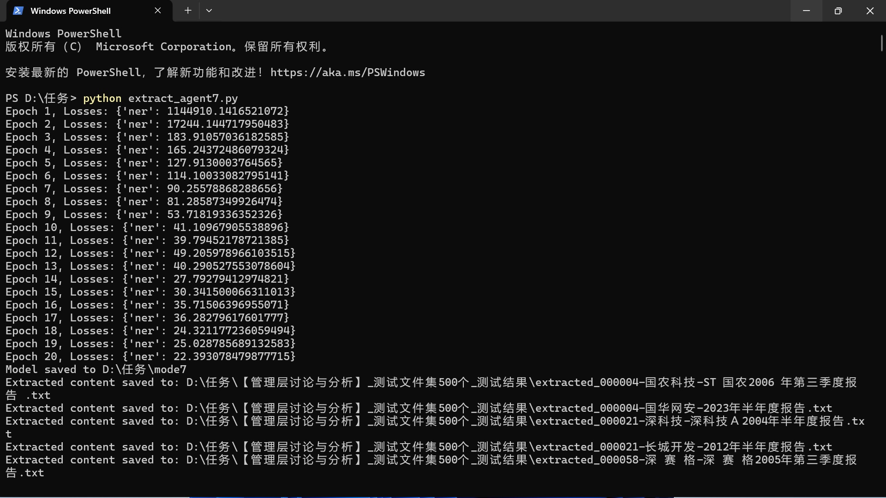
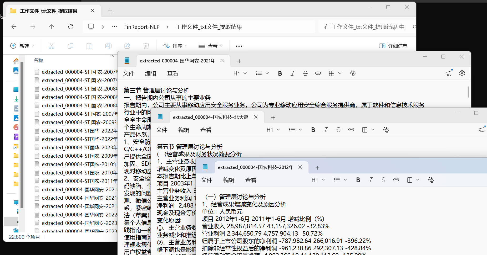
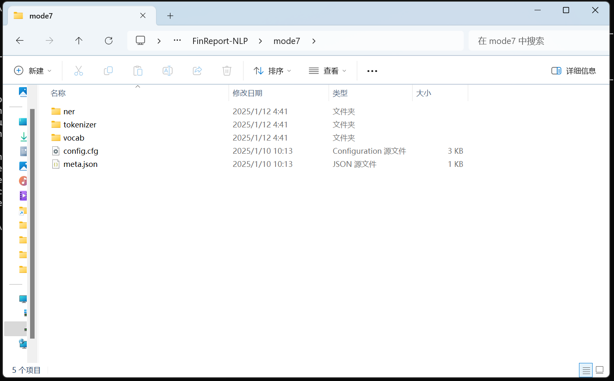

# FinReport-NLP

[English](README.md) | **简体中文**

> 面向大规模财务报告的 NLP 信息抽取系统。

[](https://www.python.org/)
[](LICENSE)
[](https://spacy.io/)
[](models/mode7/)
[](https://doi.org/10.5281/zenodo.22304240)

FinReport-NLP 是一套基于 NLP 的文档信息抽取流水线，用于从大规模财务报告中自动识别并提取目标章节。

项目最初面向约 **22,800** 份财务报告文档，用于抽取特定语义模块，例如：

- 管理层讨论与分析（MD&A）
- 风险因素
- 业务概览
- 其他目标财报章节

覆盖从文档预处理、训练数据构建，到 **spaCy NER** 模型训练、混合推理、结果校验以及大规模批量抽取的完整流程。

最初开发于 2024–2025 年，于 2026 年重新整理并开源。

### 真实业务验证

本流水线最初用于一项 **付费博士研究数据处理任务**。经过多轮训练（**mode1 → mode7**），最终的 **mode7** 模型在全量约 22,800 份语料上完成了目标章节抽取。研究者对交付结果高度认可——该项目经过真实学术工作流验证，而非仅停留在演示阶段。

---

## 功能特点

- 大规模财务文档批量处理
- PDF / 文本预处理（`pdfplumber`）
- 训练数据构建与校验
- spaCy 中文空白模型 + NER（标签：`TARGET_SECTION`）
- 混合抽取：**规则优先**，NER 回退
- **内置最终预训练模型 `mode7`**
- 批量推理与抽取日志
- 结构化文本 / JSON 输出

---

## 预训练模型：mode7

最终生产模型位于 [`models/mode7/`](models/mode7/)（约 3.7 MB）。它是多次训练迭代（mode1–mode7）后的最终版本。

训练终端日志（20 个 epoch；损失收敛；随后批量抽取）：



大规模抽取结果（约 **22,800** 个输出文件；部分「管理层讨论与分析」样例已打开）：



打包后的 spaCy 模型目录结构（`ner` / `tokenizer` / `vocab` + `config.cfg` / `meta.json`）。
可通过 `spacy.load("models/mode7")` 或下方命令行加载：



```bash
python scripts/extract_sections.py \
  --input path/to/txt_reports \
  --output outputs/ \
  --model models/mode7
```

**下载方式**

- 仓库内模型：[`models/mode7/`](models/mode7/)
- GitHub Release 附件：[`mode7-spacy.zip`](https://github.com/jasonlhw-rgb/FinReport-NLP/releases/download/v0.1.1/mode7-spacy.zip)
- Hugging Face：[jasonlhw-rgb/finreport-nlp-mode7](https://huggingface.co/jasonlhw-rgb/finreport-nlp-mode7)

发布说明见 [`docs/publishing.md`](docs/publishing.md)。

---

## 项目流程

```text
财务报告
        │
        ▼
PDF / 文本预处理
        │
        ▼
文本清洗与关键词过滤
        │
        ▼
训练数据集构建
        │
        ▼
spaCy NER 模型训练（mode1 → mode7）
        │
        ▼
混合推理（规则 → NER）
        │
        ▼
目标章节抽取（约 22,800 份）
        │
        ▼
校验与后处理
        │
        ▼
结构化输出
```

### 示例

**输入（节选）：**

```text
第三节 管理层讨论与分析
报告期内，公司实现营业收入110亿元……
第四节 公司治理
```

**输出：**

```json
{
  "section": "管理层讨论与分析",
  "text": "报告期内，公司实现营业收入110亿元……"
}
```

---

## 技术栈（以原始代码核实为准）

| 组件 | 选择 |
|-----------|--------|
| 框架 | [spaCy](https://spacy.io/) `>=3.8,<3.9` |
| 模型 | `spacy.blank("zh")` + `ner` 管道 |
| 标签 | `TARGET_SECTION` |
| 最终产物 | `models/mode7` |
| 训练 | 20 epochs，minibatch=4，dropout=0.2 |
| 混合策略 | 正则起止标记 → NER 回退 |
| PDF | `pdfplumber` |

---

## 安装

```bash
git clone https://github.com/jasonlhw-rgb/FinReport-NLP.git
cd FinReport-NLP
python -m venv .venv

# Windows
.venv\Scripts\activate

# Linux / macOS
# source .venv/bin/activate

pip install -r requirements.txt
python -m spacy download zh_core_web_sm
```

> 说明：训练使用的是 **空白** 中文模型（`spacy.blank("zh")`），因此核心流水线并不强制下载预训练包。若需要额外的中文 NLP 能力，可再安装上述模型。

---

## 快速开始

### A. 使用已发布的 mode7 模型

```bash
python scripts/extract_sections.py \
  --input data/sample/reports \
  --output outputs/ \
  --model models/mode7 \
  --log outputs/extraction_log.csv
```

### B. 复现小型训练演示

```bash
python scripts/validate_dataset.py

python scripts/train.py \
  --data data/sample/sample_training_data.json \
  --output models/target_section_ner \
  --epochs 5
```

---

## 数据集

| 资源 | 说明 | 链接 |
|----------|-------------|------|
| 仓库内样例 | 合成演示 JSON 与报告 | [`data/sample/`](data/sample/) |
| 全量 TXT 语料 | 约 **22,800** 份财报文本 | https://caiwushi.net/ |
| 训练 / 测试 / 较小数据集 | 标注训练数据、测试集及相关文件 | [Google Drive](https://drive.google.com/drive/folders/19Qco5VdHnL1niEejzCE-LQr3aiEFF6E-?usp=drive_link) |

详见 [`data/README.md`](data/README.md)。

使用外部语料时，请遵守相应版权与研究使用规范。

---

## 项目结构

```text
FinReport-NLP/
├── src/finreport_nlp/     # 核心库
├── scripts/               # 命令行入口
├── configs/
├── data/sample/           # 合成演示数据
├── models/mode7/          # 最终预训练 spaCy NER 模型
├── examples/
├── docs/                  # 架构、历史、发布指南
├── tests/
├── README.md              # 英文说明
├── README_ZH.md           # 中文说明
├── LICENSE
└── requirements.txt
```

---

## 开发历程

项目经历了多轮实验迭代，包括 **从早期版本持续训练直至 mode7**：

1. 财务文档收集与 PDF→文本转换
2. 关键词过滤（如「管理层讨论与分析」）
3. 训练样本构建与 JSON 规范化
4. 迭代式 spaCy NER 训练（**mode1 → mode6**）
5. 最终模型 **mode7** + 规则鲁棒性增强（`extract_agent7`）
6. 约 22,800 份文件的大规模批量推理
7. 交付博士研究委托方（反馈高度认可）
8. 开源重组（2026）

详见 [`docs/development-history.md`](docs/development-history.md)。

---

## 适用场景

- 金融 / 学术研究
- 金融文本挖掘
- 企业分析
- 文档智能 / Document AI
- 另类金融数据构建

---

## 局限

抽取效果取决于报告版式、OCR/PDF 文本质量、文档结构、语言、训练数据以及目标章节定义。

本仓库是 **研究与工程参考实现**，并非生产级财务数据服务。

---

## 路线图

- [x] 在仓库中发布预训练模型 **mode7**
- [x] 在 Hugging Face Model Hub 镜像 mode7
- [x] GitHub Release 附带 `mode7-spacy.zip`
- [x] Zenodo DOI（[10.5281/zenodo.22304240](https://doi.org/10.5281/zenodo.22304240)）
- [ ] 评测基准（Precision / Recall / F1）
- [ ] 增强异构报告版式的预处理
- [ ] 多语言 / 多章节支持
- [ ] Docker 支持
- [ ] GitHub Actions CI
- [ ] 可选演示（Hugging Face Spaces）

---

## 联系方式

如有问题、合作意向，或希望学术复用数据集：

- 邮箱：**jason.lhw2025@gmail.com**
- GitHub Issues：https://github.com/jasonlhw-rgb/FinReport-NLP/issues

---

## 贡献

欢迎贡献代码、报告问题与提出建议。
提交前请先阅读 [CONTRIBUTING.md](CONTRIBUTING.md)。

---

## 引用

若在研究中使用本项目，请引用：

> jasonlhw-rgb. (2026). *FinReport-NLP: Large-scale NLP-based information extraction from financial reports* (v0.1.1). Zenodo. https://doi.org/10.5281/zenodo.22304240

- DOI：https://doi.org/10.5281/zenodo.22304240
- 机器可读引用：[`CITATION.cff`](CITATION.cff)
- 中文技术文章：[`docs/article-zh.md`](docs/article-zh.md)

---

## 许可证

本项目采用 MIT 许可证，详见 [LICENSE](LICENSE)。
